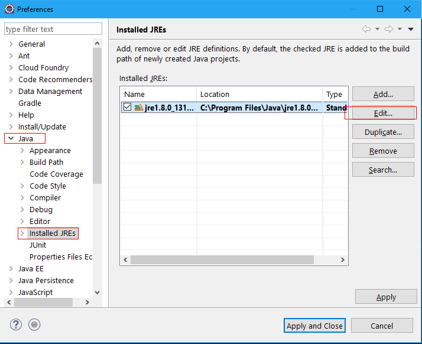
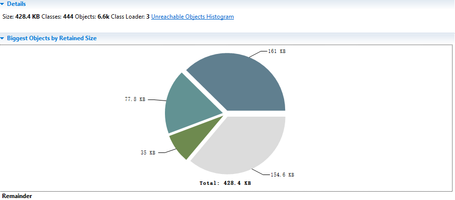

一、安装MAT
1. 在Help->Eclipse Marketplace中搜索MAT安装即可。
使用时 new->project->other->MAT,首次使用需设置JDK位置

2. 在官网下载 http://www.eclipse.org/mat/
解压出来，想要用的时候打开就行了
推荐第二种


二、使用MAT



点击edit后在Default VM arguments中设置VM最大内存为 -Xms2M
(参数说明：
-Xms128M 最大使用内存
-Xmx512M 最小使用内存)

然后运行以下程序,就会在项目根目录下出现.hprof文件
```
public class LeakTest {
    public static void main(String[] args) {
        Vector v = new Vector(10);
        for (int i = 1; i < 100; i++) {
            Object o = new Object();
            v.add(o);
            o = null;
        }
        System.out.println(Arrays.toString(v.toArray()));
    }
}
```
此时打开MAT，open刚才的.hprof文件，就会出现分析结果    
